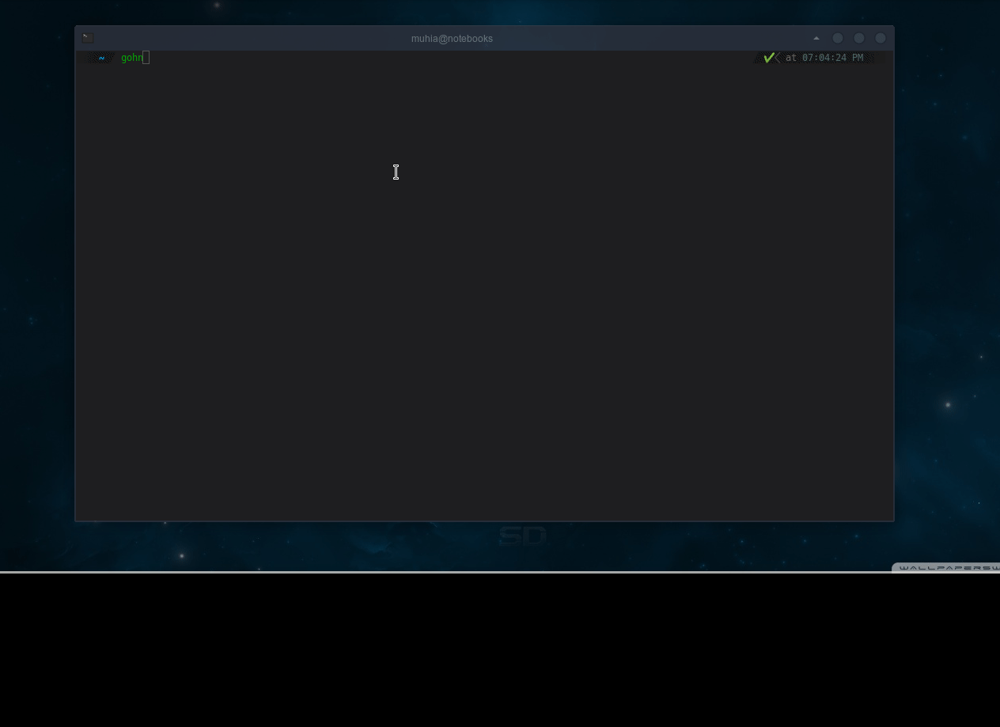

#  GoHN

This is a very simple hackernews client in Golang 



### Running the app

```sh
$ git clone https://github.com/MuhiaKevin/gohn.git
$ cd gohn
$ go get ./...
$ go build && ./gohn 
```


Happy Coding !